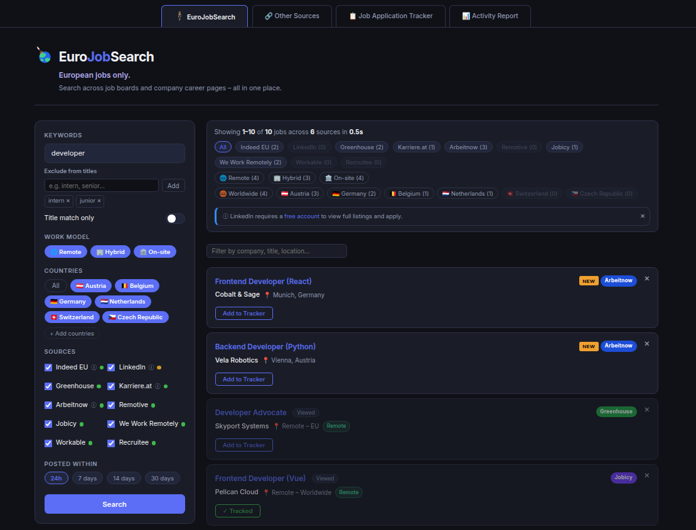

# EuroJobSearch

European jobs only. Search across job boards and company career pages – all in one place.

A Flask-based job search aggregator for the European job market. It searches ten sources in parallel – Indeed EU, LinkedIn, Greenhouse, Karriere.at, Profession.hu, No Fluff Jobs, Arbeitnow, Remotive, Jobicy, and We Work Remotely – deduplicates results, and presents them in one filterable view: country, work model, source, and keyword, all combinable. A built-in Job Application Tracker lets you save and manage applications directly in the app.

Try the [interactive demo](https://teokitten.github.io/eurojobsearch/) with sample data – no install required.



## Setup

Requires Python 3.12 or later.

### Windows

1. Install Python from [python.org](https://www.python.org/downloads/) if not already installed. During installation, check the box labeled "Add Python to PATH."
2. Download this repository: click the green "Code" button above, then "Download ZIP," and extract it. (Or, if you have git installed, run `git clone` with the repository URL.)
3. Open Command Prompt and navigate to the extracted folder, for example:
   ```
   cd Downloads\eurojobsearch
   ```
4. Install Poetry if needed, then install dependencies:
   ```
   poetry install
   ```
5. Run the app:
   ```
   poetry run python app.py
   ```
6. Open `http://localhost:5000` in your browser.

### macOS

1. Check if Python 3.12+ is installed by running `python3 --version` in Terminal. If not installed, install it from [python.org](https://www.python.org/downloads/) or with `brew install python3`.
2. Download this repository: click the green "Code" button above, then "Download ZIP," and extract it. (Or, if you have git installed, run `git clone` with the repository URL.)
3. Open Terminal and navigate to the extracted folder, for example:
   ```
   cd Downloads/eurojobsearch
   ```
4. Install Poetry if needed, then install dependencies:
   ```
   poetry install
   ```
5. Run the app:
   ```
   poetry run python3 app.py
   ```
6. Open `http://localhost:5000` in your browser.

### Linux

1. Python 3.12+ is usually preinstalled. Check with `python3 --version`. If it's missing, install it with your package manager, for example `sudo apt install python3 python3-pip` on Ubuntu/Debian.
2. Download this repository: click the green "Code" button above, then "Download ZIP," and extract it. (Or, if you have git installed, run `git clone` with the repository URL.)
3. Open a terminal and navigate to the extracted folder, for example:
   ```
   cd Downloads/eurojobsearch
   ```
4. Install Poetry if needed, then install dependencies:
   ```
   poetry install
   ```
5. Run the app:
   ```
   poetry run python3 app.py
   ```
6. Open `http://localhost:5000` in your browser.

To stop the app, press Ctrl+C in the terminal.

## Sources

| Source | Notes |
|---|---|
| Indeed EU | Per-country search. If no countries are selected, falls back to Germany-remote-only results. |
| LinkedIn | May rate-limit after repeated use. Requires a free account to view full listings and apply. |
| Greenhouse | Queries a curated list of company job boards via the public Greenhouse API. |
| Karriere.at | Austria only. |
| Profession.hu | Hungary only. |
| No Fluff Jobs | Requires at least one selected country. |
| Arbeitnow | Germany, Austria, and Switzerland only. |
| Remotive | Remote roles only. |
| Jobicy | Remote roles only. |
| We Work Remotely | Remote roles only. |

## Keyword search

The keyword field supports comma-separated AND queries. All terms must appear in the job title or description for a result to be returned.

- `technical writer` – standard single-term search
- `technical writer, freelance` – returns only jobs matching both terms
- `technical writer, contract` – same pattern for contract roles

The primary term (before the first comma) is sent to each source's search API. Secondary terms are matched locally against fetched results.

Common employment-type terms expand automatically to synonyms. Searching for `freelance` also matches: contractor, contract, B2B, CDD, Werkvertrag, freiberuflich. Searching for `contract` matches: contractor, freelance, B2B, CDD, Werkvertrag. Searching for `part time` or `part-time` matches: Teilzeit.

## Browsing results

Once results load, you can narrow them further without running a new search. The filter bar above the results accepts any text – company name, job title, or location – and updates the list instantly.

Jobs that weren't in your previous search with the same filters are marked **NEW** and sorted to the top. The badge stays on the card until you click it. This is most useful when you run the same search daily – new postings since yesterday will surface immediately without you having to scan through everything again.

## Other Sources

The **Other Sources** tab lists job boards and company career pages that don't have a public API and can't be searched automatically. Open them directly to search manually. These complement the automated sources rather than replace them – some boards have strong regional coverage or niche audiences worth checking separately.

## Job Application Tracker

A built-in tracker tab lets you manage job applications without leaving the app. Data is stored locally in your browser (localStorage) and persists across sessions.

### Adding jobs

- **From search results**: click "Add to Tracker" on any job card. Company, title, location, platform, and URL are pre-filled automatically.
- **Manually**: switch to the Job Application Tracker tab and click "+ Add Job" to enter details by hand. Useful for jobs found outside EuroJobSearch.

### Application statuses

| Status | Meaning |
|---|---|
| Saved | Shortlisted, not yet applied |
| Applied | Applied, waiting to hear back |
| Interviewing | Active interview process |
| Rejected | Application closed |

The **All Applications** chip shows a combined count of Applied, Interviewing, and Rejected – your total application volume at a glance.

### Import and export

- **Export CSV**: downloads your full tracker list as a CSV file compatible with Excel and Google Sheets.
- **Import CSV**: loads jobs from a CSV file. Expects the same column headers as the export (Company, Role, Location, Work Model, Platform, Status, URL, Date Added, Notes). Use this to migrate from the standalone [Job Tracker](https://teokitten.github.io/job-tracker) or any other CSV-based tracker.
- **Print / PDF**: opens the browser print dialog with a clean print stylesheet applied – tracker table only, no UI chrome.

### Notes

- Tracker data is stored under the key `ejs_tracker_v1` in your browser's localStorage. Clearing browser data will erase it – export regularly.
- Company names are not always available from all sources (Karriere.at in particular uses image-based logos). In those cases the company field defaults to "Unknown" and can be edited manually.

## Known limitations

- **Indeed EU**: if no countries are selected, results are limited to Germany-based remote jobs.
- **Greenhouse**: locations formatted like "Germany (Remote); Ireland (Remote)" are detected as remote only, not as all listed countries.
- **Arbeitnow**: its API does not support a search-term parameter; results are filtered by keyword after fetching.
- **Profession.hu / No Fluff Jobs**: both integrations rely on HTML parsing and may need selector updates if the sites change layout.
- **LinkedIn**: automated requests may be rate-limited after repeated use.
- **LinkedIn hybrid detection**: LinkedIn does not expose work type (hybrid/remote/on-site) through the scraping layer used by this app. Hybrid jobs from LinkedIn will not be tagged as hybrid in results – this is a platform limitation, not a bug.
- **LinkedIn NEW badge**: LinkedIn returns different jobs on every search regardless of filters. The NEW badge may be inconsistent for LinkedIn results as a consequence.
- **Czech Republic / LinkedIn**: JobSpy internally misinterprets "Czech Republic" as "Dominican Republic". Czech Republic results still appear via LinkedIn's Europe-wide call.
- **Karriere.at**: company name and date are not available for Karriere.at results. Their RSS feed was removed in 2017; the app falls back to HTML scraping which can only extract job titles and URLs.

## Company career pages (Greenhouse)

Greenhouse exposes a public JSON API for company job boards – no account or API key needed. The app queries a curated list of European company career pages (`companies.json`) and filters results by keyword, country, and work model, same as every other source.

## Adding companies to the Greenhouse source

Only companies listed under `"greenhouse"` in `companies.json` are searched. To add one, find the `{slug}` portion of the company's Greenhouse-hosted careers page URL and add it to the list in `companies.json`.

## License

MIT
