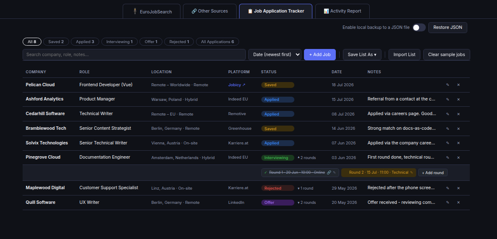
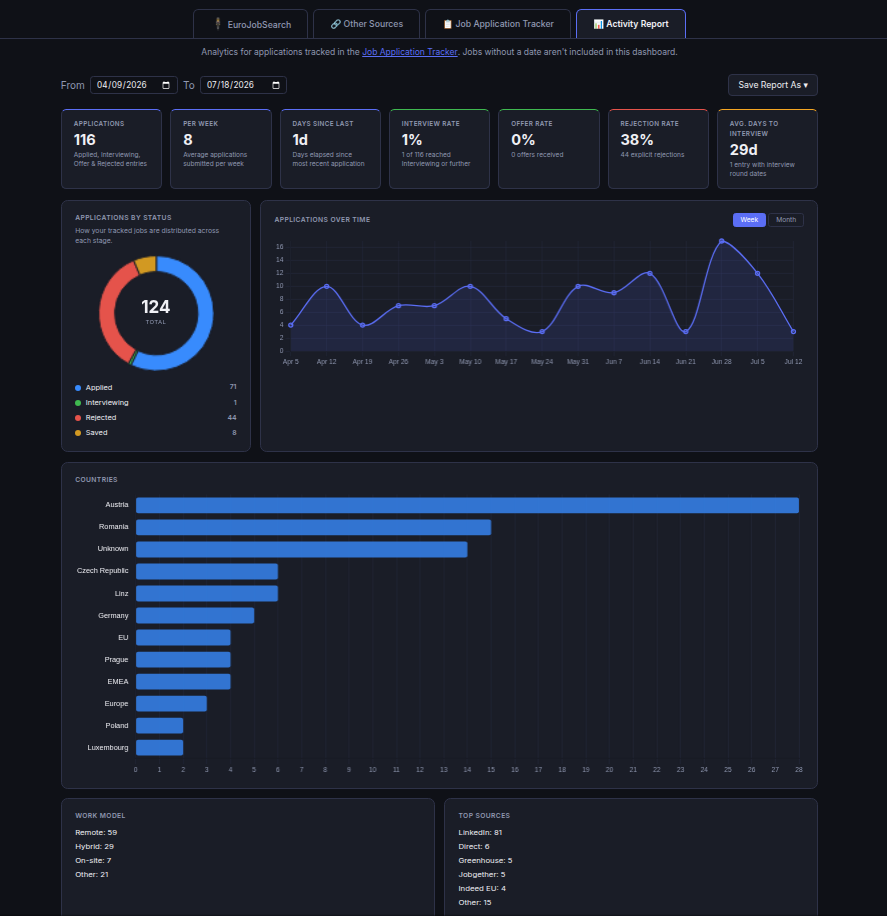

# EuroJobSearch

European jobs only. Search across job boards and company career pages – all in one place.

A Flask-based job search aggregator for the European job market. It searches ten sources in parallel – Indeed EU, LinkedIn, Greenhouse, Karriere.at, Arbeitnow, Remotive, Jobicy, We Work Remotely, Workable, and Recruitee – deduplicates results, and presents them in one filterable view: country, work model, source, and keyword, all combinable. A built-in Job Application Tracker lets you save and manage applications directly in the app, alongside an Activity Report dashboard with charts and metrics.

Try the [interactive demo](https://teokitten.github.io/eurojobsearch/) with sample data – no install required.


## Setup

Requires Python 3.10 or later.

### Windows

1. Install Python from [python.org](https://www.python.org/downloads/) if not already installed. During installation, check the box labeled "Add Python to PATH."
2. Download this repository: click the green "Code" button above, then "Download ZIP," and extract it. (Or, if you have git installed, run `git clone` with the repository URL.)
3. Open Command Prompt and navigate to the extracted folder, for example:
   ```
   cd Downloads\eurojobsearch
   ```
4. Install dependencies:
   ```
   pip install -r requirements.txt
   ```
5. Run the app:
   ```
   python app.py
   ```
6. Open `http://localhost:5000` in your browser.

### macOS

1. Check if Python 3.10+ is installed by running `python3 --version` in Terminal. If not installed, install it from [python.org](https://www.python.org/downloads/) or with `brew install python3`.
2. Download this repository: click the green "Code" button above, then "Download ZIP," and extract it. (Or, if you have git installed, run `git clone` with the repository URL.)
3. Open Terminal and navigate to the extracted folder, for example:
   ```
   cd Downloads/eurojobsearch
   ```
4. Install dependencies:
   ```
   pip3 install -r requirements.txt
   ```
5. Run the app:
   ```
   python3 app.py
   ```
6. Open `http://localhost:5000` in your browser.

### Linux

1. Python 3.10+ is usually preinstalled. Check with `python3 --version`. If it's missing, install it with your package manager, for example `sudo apt install python3 python3-pip` on Ubuntu/Debian.
2. Download this repository: click the green "Code" button above, then "Download ZIP," and extract it. (Or, if you have git installed, run `git clone` with the repository URL.)
3. Open a terminal and navigate to the extracted folder, for example:
   ```
   cd Downloads/eurojobsearch
   ```
4. Install dependencies:
   ```
   pip3 install -r requirements.txt
   ```
5. Run the app:
   ```
   python3 app.py
   ```
6. Open `http://localhost:5000` in your browser.

To stop the app, press Ctrl+C in the terminal.

## Sources

| Source | Notes |
|---|---|
| Indeed EU | Per-country search. If no countries are selected, falls back to Germany-remote-only results. |
| LinkedIn | May rate-limit after repeated use. Requires a free account to view full listings and apply. |
| Greenhouse | Queries a curated list of company job boards via the public Greenhouse API. |
| Karriere.at | Austria only. |
| Arbeitnow | Germany, Austria, and Switzerland only. Listings are mostly German-language, so English keyword searches often return few results. |
| Remotive | Remote roles only. |
| Jobicy | Remote roles only. |
| We Work Remotely | Remote roles only. |
| Workable | Queries a curated list of company career pages via Workable's public API. Not country-gated – results are filtered like every other source. |
| Recruitee | Queries a curated list of company career pages via Recruitee's public API. Not country-gated. |

Each source has a live status indicator in the search form (a small colored dot next to its checkbox) showing whether the last fetch succeeded, is still failing, or hasn't been checked yet – hover it for details including how many jobs were fetched before filtering.

## Keyword search

The keyword field supports comma-separated AND queries. All terms must appear in the job title or description for a result to be returned.

- `technical writer` – standard single-term search
- `technical writer, freelance` – returns only jobs matching both terms
- `technical writer, contract` – same pattern for contract roles

The primary term (before the first comma) is sent to each source's search API. Secondary terms are matched locally against fetched results.

Common employment-type terms expand automatically to synonyms. Searching for `freelance` also matches: contractor, contract, B2B, CDD, Werkvertrag, freiberuflich. Searching for `contract` matches: contractor, freelance, B2B, CDD, Werkvertrag. Searching for `part time` or `part-time` matches: Teilzeit.

### Excluding keywords

Below the Keywords field, a separate "Exclude from titles" control lets you permanently filter out jobs whose title matches a given term (e.g. `intern`, `senior`) – applied across all searches, not just the current one, until removed. Add a term and press Enter or click Add; remove one by clicking the × on its chip. This persists in your browser between sessions.

## Browsing results

Once results load, you can narrow them further without running a new search. The filter bar above the results accepts any text – company name, job title, or location – and updates the list instantly.

Jobs that weren't in your previous search with the same filters are marked **NEW** and sorted to the top. The badge stays on the card until you click it. This is most useful when you run the same search daily – new postings since yesterday will surface immediately without you having to scan through everything again.

Results are paginated at 25 per page.

## Other Sources

The **Other Sources** tab lists job boards and company career pages that don't have a public API and can't be searched automatically. Open them directly to search manually. These complement the automated sources rather than replace them – some boards have strong regional coverage or niche audiences worth checking separately.

## Job Application Tracker



A built-in tracker tab lets you manage job applications without leaving the app. Data is stored locally in your browser (localStorage) and persists across sessions. Results are paginated at 25 per page.

### Adding jobs

- **From search results**: click "Add to Tracker" on any job card. Company, title, location, platform, and URL are pre-filled automatically.
- **Manually**: switch to the Job Application Tracker tab and click "+ Add Job" to enter details by hand. Useful for jobs found outside EuroJobSearch.

### Application statuses

| Status | Meaning |
|---|---|
| Saved | Shortlisted, not yet applied |
| Applied | Applied, waiting to hear back |
| Interviewing | Active interview process |
| Offer | Received an offer |
| Rejected | Application closed |

The **All Applications** chip shows a combined count of Applied, Interviewing, Offer, and Rejected – your total application volume at a glance.

### Interview rounds

For jobs marked Interviewing, you can track each interview round individually rather than relying on the Notes field. Click the summary next to the status dropdown (it reads "+ interview date" if none are added yet, otherwise the next upcoming round or a round count) to expand a row where rounds are listed as chips.

Each round records:

- Date and time (in 15-minute increments)
- Type – phone screen, technical, onsite, final round, HR/culture fit, or Online, which reveals a clickable meeting link field
- Attendees
- Notes
- Outcome – not yet decided, Passed, or Failed

Marking a round Failed automatically sets the job's status to Rejected. Round history stays attached to the job afterward – expanding a Rejected or Offer job's summary still shows every round that happened, so you can look back at how far a process went. Adding further rounds is locked once a job reaches Offer, or Rejected via a failed round; moving the status back to Interviewing unlocks it again.

### Notes and screenshots

Click any Notes cell to edit it inline: type your note, press Enter to save or Shift+Enter for a new line, Esc to cancel. Attach a screenshot via the paperclip icon at the bottom-left of the notes field, or paste an image directly from your clipboard – useful for saving a rejection email or an interview invite alongside the entry. Attachments are stored separately from the main tracker data (in IndexedDB, not localStorage) and are excluded from CSV/PDF exports.

### Import and export

- **Save List As**: exports your full tracker list as CSV or PDF (menu button). CSV is compatible with Excel and Google Sheets. PDF opens the browser print dialog with a clean, chrome-free stylesheet – the Notes column and screenshot attachments are left out of the printed/PDF version so a long note doesn't blow up the page count (e.g. when submitting job search activity to an unemployment office); CSV always includes Notes in full, but not attachments.
- **Import List**: loads jobs from a CSV file. Expects the same column headers as the export (Company, Role, Location, Work Model, Platform, Status, URL, Date Added, Notes). Use this to migrate from the standalone [Job Tracker](https://teokitten.github.io/job-tracker) or any other CSV-based tracker.

### Local backup

A toggle above the tracker table ("Enable local backup to a JSON file") lets you back up your tracker data to a file on your computer every 3 days, using your browser's File System Access API (Chrome/Edge only – not supported in Firefox/Safari). Separately, a lightweight rotating backup is always kept in browser storage automatically, regardless of this toggle. If tracker data drops unexpectedly (e.g. from a bug or accidental action), a restore prompt appears automatically comparing your current data against the backup, and lets you merge back anything missing – it adds entries from the backup that aren't already present, it does not overwrite existing entries. You can also manually restore from a `.json` backup file via **Restore JSON**.

## Activity Report



A dedicated tab showing metrics and charts for your tracked job search, covering your entire history by default (jobs without a `dateAdded` are excluded). Narrow to a specific period with the From/To date range.

Metrics include: applications, applications per week, interview rate, offer rate, rejection rate, average days to interview, average days to rejection, a breakdown by work model, a breakdown by source, a breakdown by country (normalized so e.g. "Czechia" and "CZ" count as one), and days since your last application. A donut chart shows your status distribution, and a line chart shows application volume over time.

**Save Report As** exports the current view as CSV (one metric per row) or PDF.

### Notes

- Tracker data is stored under the key `ejs_tracker_v1` in your browser's localStorage. Clearing browser data will erase it – the local file backup and CSV export are your best protection against this.
- Company names are not always available from all sources (Karriere.at in particular uses image-based logos). In those cases the company field defaults to "Unknown" and can be edited manually.

## Known limitations

- **Indeed EU**: if no countries are selected, results are limited to Germany-based remote jobs.
- **Greenhouse**: locations formatted like "Germany (Remote); Ireland (Remote)" are detected as remote only, not as all listed countries.
- **Arbeitnow**: its API does not support a search-term parameter; results are filtered by keyword after fetching. Since most listings are German-language, English keyword searches often return few or no results.
- **Workable / Recruitee**: both query a small, manually curated list of companies (see below) – result volume depends entirely on how many companies are added, and will be low until the lists grow.
- **LinkedIn**: automated requests may be rate-limited after repeated use.
- **LinkedIn hybrid detection**: LinkedIn does not expose work type (hybrid/remote/on-site) through the scraping layer used by this app. Hybrid jobs from LinkedIn will not be tagged as hybrid in results – this is a platform limitation, not a bug.
- **LinkedIn NEW badge**: LinkedIn returns different jobs on every search regardless of filters. The NEW badge may be inconsistent for LinkedIn results as a consequence.
- **Czech Republic / LinkedIn**: JobSpy internally misinterprets "Czech Republic" as "Dominican Republic". Czech Republic results still appear via LinkedIn's Europe-wide call.
- **Karriere.at**: company name and date are not available for Karriere.at results. Their RSS feed was removed in 2017; the app falls back to HTML scraping which can only extract job titles and URLs.

## Company career pages (Greenhouse, Workable, Recruitee)

These three ATS platforms expose public JSON APIs for company job boards – no account or API key needed. The app queries a curated list of European company career pages for each and filters results by keyword, country, and work model, same as every other source.

## Adding companies

Add a company's slug to the relevant file:

| ATS | File | How to find the slug |
|---|---|---|
| Greenhouse | `companies.json` | The `{slug}` in `boards.greenhouse.io/{slug}` |
| Workable | `workable_companies.json` | The `{slug}` in `apply.workable.com/{slug}` |
| Recruitee | `recruitee_companies.json` | The `{slug}` in `{slug}.recruitee.com` |

Verify a company actually uses the platform before adding it – e.g. for Workable:
```
curl -s "https://apply.workable.com/api/v1/widget/accounts/{slug}"
```
should return real job data, not an empty `jobs` array or an error.

## Demo build

`docs/index.html` is a static demo build generated from `templates/index.html` by `build_demo.py`, with mock data standing in for live API calls. It's regenerated by patching specific anchor points in the template, so after any structural change to `templates/index.html`, run:
```
python3 build_demo.py
```
and verify the output before committing – a changed anchor point can cause a silent patch failure, leaving stale content in the demo.

## License

MIT
