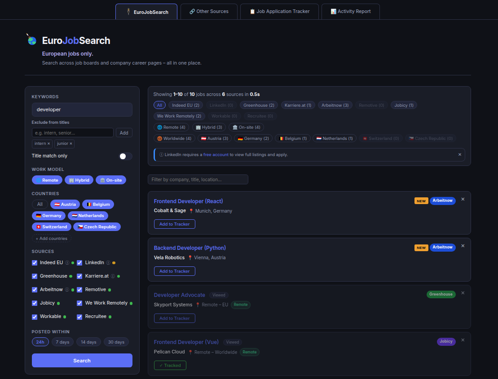

# EuroJobSearch

European jobs only. Find opportunities across Europe, track every application, and measure your response and interview rates over time.

A Flask-based job search aggregator for the European job market. It searches ten sources in parallel – Indeed EU, LinkedIn, Greenhouse, Karriere.at, Arbeitnow, Remotive, Jobicy, We Work Remotely, Workable, and Recruitee – deduplicates results, and presents them in one filterable view: country, work model, source, and keyword, all combinable. A built-in Job Application Tracker and Activity Report dashboard round out the app.

Try the [interactive demo](https://teokitten.github.io/eurojobsearch/) with sample data – no install required.



## Setup

Requires Python 3.10 or later.

### Windows

1. Install Python from [python.org](https://www.python.org/downloads/) if not already installed. During installation, check the box labeled "Add Python to PATH."
2. Download this repository: click the green "Code" button above, then "Download ZIP," and extract it. (Or, if you have git installed, run `git clone` with the repository URL.)
3. Open Command Prompt and navigate to the extracted folder, for example:
   ```
   cd Downloads\eurojobsearch
   ```
4. Install dependencies:
   ```
   pip install -r requirements.txt
   ```
5. Run the app:
   ```
   python app.py
   ```
6. Open `http://localhost:5000` in your browser.

### macOS

1. Check if Python 3.10+ is installed by running `python3 --version` in Terminal. If not installed, install it from [python.org](https://www.python.org/downloads/) or with `brew install python3`.
2. Download this repository: click the green "Code" button above, then "Download ZIP," and extract it. (Or, if you have git installed, run `git clone` with the repository URL.)
3. Open Terminal and navigate to the extracted folder, for example:
   ```
   cd Downloads/eurojobsearch
   ```
4. Install dependencies:
   ```
   pip3 install -r requirements.txt
   ```
5. Run the app:
   ```
   python3 app.py
   ```
6. Open `http://localhost:5000` in your browser.

### Linux

1. Python 3.10+ is usually preinstalled. Check with `python3 --version`. If it's missing, install it with your package manager, for example `sudo apt install python3 python3-pip` on Ubuntu/Debian.
2. Download this repository: click the green "Code" button above, then "Download ZIP," and extract it. (Or, if you have git installed, run `git clone` with the repository URL.)
3. Open a terminal and navigate to the extracted folder, for example:
   ```
   cd Downloads/eurojobsearch
   ```
4. Install dependencies:
   ```
   pip3 install -r requirements.txt
   ```
5. Run the app:
   ```
   python3 app.py
   ```
6. Open `http://localhost:5000` in your browser.

To stop the app, press Ctrl+C in the terminal.

## Sources

| Source | Notes |
|---|---|
| Indeed EU | Per-country search. Falls back to Germany-remote-only if no countries are selected. |
| LinkedIn | May rate-limit after repeated use. No hybrid detection – LinkedIn doesn't expose work type. |
| Greenhouse | Company career pages via the public Greenhouse API. |
| Karriere.at | Austria only. No company name or date available. |
| Arbeitnow | Germany, Austria, Switzerland only. Mostly German-language listings. |
| Remotive | Remote roles only. |
| Jobicy | Remote roles only. |
| We Work Remotely | Remote roles only. |
| Workable | Company career pages via Workable's public API. |
| Recruitee | Company career pages via Recruitee's public API. |

Each source shows a live status dot in the search form – hover for fetch details.

## Other Sources

A separate tab lists job boards and company career pages that don't have a public API and can't be searched automatically – open them directly to search manually. These complement the ten automated sources rather than replace them.

## Keyword search

Comma-separated terms use AND logic: `technical writer, freelance` requires both. Use `|` for OR: `technical writer | copywriter` matches either. Combine both: `technical writer | copywriter, freelance`. Employment-type terms expand to synonyms automatically (`freelance` also matches contractor, contract, B2B, CDD, Werkvertrag, freiberuflich, etc.). Note: OR only fully broadens results on sources without server-side search (Arbeitnow, Jobicy, Remotive) – on Indeed, LinkedIn, and the company-API sources it refines within what the primary term already returned. A separate "Exclude from titles" control permanently filters out jobs by title term across all searches.

## Job Application Tracker

Save jobs directly from search results or add them manually, track status (Saved → Applied → Interviewing → Offer/Rejected, plus a Dropped status for applications you walk away from yourself), log interview rounds individually, attach notes and screenshots, and export/import as CSV or PDF. Notes are timestamped entries. A small marker next to each job's link lets you flag postings that are no longer accepting applications. A date range filter narrows the table and both exports to a specific period. Tracker data lives in your browser's localStorage – enable local file backup (Chrome/Edge only) or export CSV regularly, since clearing browser data erases it.

## Activity Report

Metrics and charts for your tracked job search: application volume, interview/offer/rejection rates, response times, and breakdowns by work model, source, status, and country.

## Known limitations

- **Indeed EU**: falls back to Germany-remote-only if no countries are selected.
- **Greenhouse**: multi-country locations like "Germany (Remote); Ireland (Remote)" are detected as remote only.
- **Arbeitnow**: no search-term API param; keyword-filtered post-fetch, so mostly-German listings return few English-keyword matches.
- **Workable / Recruitee**: result volume depends on how many companies are in each curated list.
- **LinkedIn**: rate-limits after repeated use; returns different jobs per identical search, so the NEW badge can be inconsistent.
- **Czech Republic / LinkedIn**: JobSpy internally misreads "Czech Republic" as "Dominican Republic" – results still surface via LinkedIn's Europe-wide call.

## License

MIT
